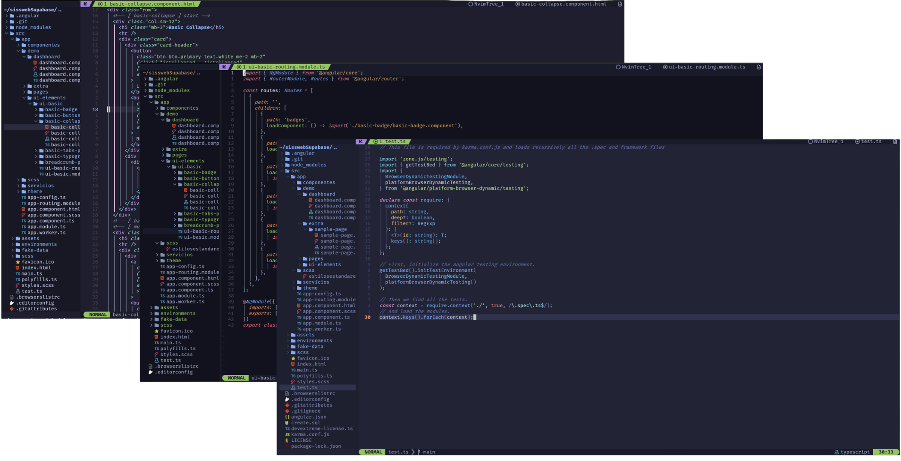

<div align="center">

# Ultra Nvim

### Neovim listo para producir

[](https://neovim.io/)
[](https://www.lua.org/)
[](https://github.com/folke/lazy.nvim)

**Config extensible** con *lazy.nvim*, Mason, LSP nativo, Telescope, árbol de archivos, Git, **conform**, snippets, Flash, Treesitter, Diffview, sesiones y DAP.

[Instalación](#-instalación) · [Características](#-características) · [Lenguajes](#-lenguajes) · [Sitio web](#-sitio-web-github-pages)

</div>

---

<p align="center">
  
</p>

<p align="center">
  <sub></sub>
</p>

---

## Por qué Ultra Nvim

| | |
| :--- | :--- |
| **Rápida por diseño** | *lazy.nvim* con carga diferida: menos arranque, más tiempo editando. |
| **LSP y Mason** | Servidores y herramientas alineados; adjuntos LSP y utilidades en un solo lugar. |
| **UI que no estorba** | Tema, barra de estado, árbol y buscadores para una experiencia coherente. |
| **Git y diff** | Flujo Git cómodo y **Diffview** cuando necesitas ver el bosque y los árboles. |
| **Productividad** | **Telescope**, Flash, surround, textobjects Treesitter, **conform** y snippets. |
| **Debug y sesiones** | **DAP** donde terminal y código conviven; **AutoSession** para retomar el contexto. |

> *Lo esencial ya resuelto; tú añades opiniones.* Defaults sensatos, Lua legible y extensiones sin drama.

---

## Requisitos

- **Neovim ≥ 0.10**
- **Git**
- En Unix: herramientas de compilación razonables (**Treesitter**, **LuaSnip**).

---

## Lenguajes

Un stack, muchos lenguajes — la base crece contigo:

JavaScript · TypeScript · JSON · Python · Bash · Markdown · C / C++ · C# · Go · HCL · Terraform · Java · Julia · Lua · PowerShell · QML · Ruby · Rust · Scala · Swift · *y lo que añadas tú.*

---

## Instalación

Haz **backup** de `~/.config/nvim` si ya tienes una configuración.

### Clonar el starter

```bash
git clone https://github.com/DarkSevenX/ultra-nvim-starter.git ~/.config/nvim
cd ~/.config/nvim && nvim
```

### Repo local (symlink)

Si trabajas dentro del monorepo con la carpeta `ultra-nvim-starter`:

```bash
ln -sfn "$(pwd)/ultra-nvim-starter" ~/.config/nvim
nvim
```

---

## Estructura (resumen)

El núcleo vive en **`ultra-nvim-starter/`** — por ejemplo:

- `init.lua` — entrada y autocmds TSX/JSX
- `lua/config/` — `core`, `lazy`, `keymaps`, LSP attach, etc.
- `lua/plugins/` — módulos por herramienta (Telescope, Mason, DAP, UI…)

---
